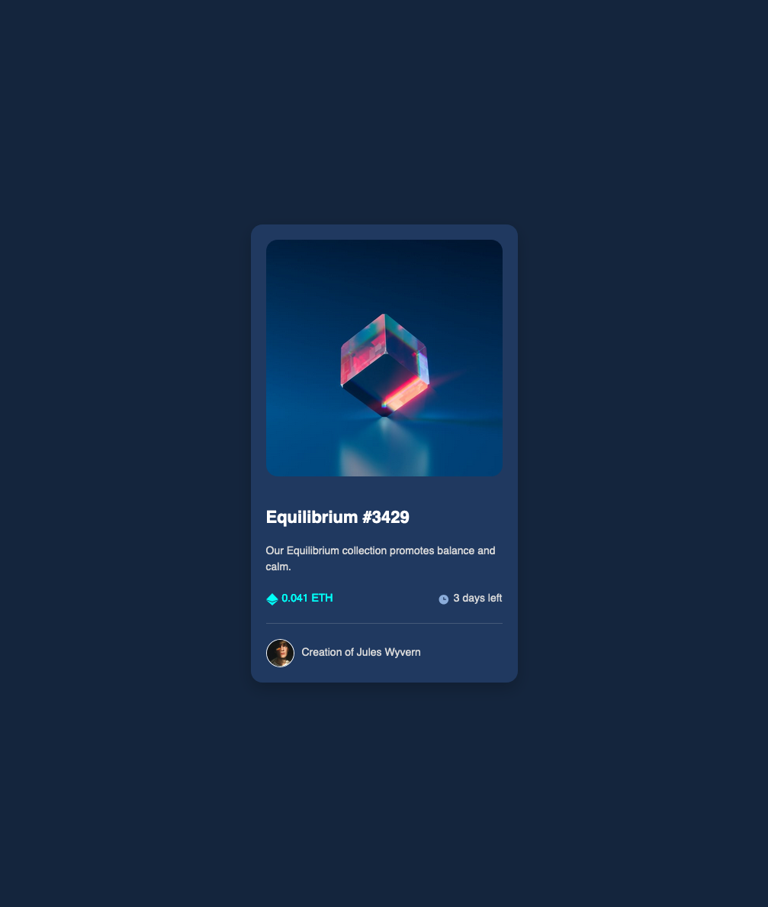

# Frontend Mentor - NFT preview card component solution

This is a solution to the [NFT preview card component challenge on Frontend Mentor](https://www.frontendmentor.io/challenges/nft-preview-card-component-SbdUL_w0U). Frontend Mentor challenges help you improve your coding skills by building realistic projects.

## Overview

### The challenge

Users should be able to:

- View the optimal layout depending on their device's screen size
- See hover states for interactive elements

### Screenshot

### Links

- Solution URL: [Add solution URL here](https://your-solution-url.com)
- Live Site URL: [Add live site URL here](https://your-live-site-url.com)

### Tools and Technologies

- **React with TypeScript**: For building reusable and modular components.
- **CSS Modules**: For scoped and maintainable styling.
- **Flexbox** and **CSS Grid**: For layout and centering the card.
- **Frontend Mentor Design Assets**: For icons, images, and layout inspiration.

### Components Structure

1. **NFTCard** (Root Component):
   - Combines all child components into the final card.
2. **TitleAndDescription**:
   - Displays the NFT title and description, with hover effects.
3. **Details**:
   - Shows the price with an Ethereum icon and time left with a clock icon.
4. **CreatorInfo**:
   - Displays the creator's profile picture and name (centered, with hover effects).

### Design Details

- Used global CSS variables for consistent color and typography.
- Added hover effects for interactive elements (image overlay, title, and links).
- Applied responsive styling to ensure a polished layout on different screen sizes.

---

## What I Learned

### Technical Takeaways

1. **Component Composition**:
   - Breaking the design into smaller, reusable components improved readability and maintainability.
   - Passing props to child components made data management simpler.
2. **CSS Best Practices**:
   - Leveraged scoped CSS Modules to avoid global conflicts.
   - Used `gap` for spacing in flexbox and grid layouts, reducing reliance on margin hacks.
   - Aligned text and images with flexbox for precision in layouts.
3. **Hover Effects**:
   - Enhanced interactivity using subtle hover states on key elements (e.g., title and overlay).
4. **Responsive Design**:
   - Ensured a visually consistent experience across different screen sizes using `max-width` and `padding`.

### Design and Workflow Insights

- Refined my understanding of aligning elements both horizontally and vertically (e.g., `justify-content` vs. `align-items`).
- Learned to adapt designs when specifications (like padding or font sizes) are unclear, using judgment to match the layout.

---

## Focus Areas Going Forward

1. **Accessibility**:
   - Add `aria-labels` and other accessibility features to improve usability for assistive technologies.
2. **Advanced CSS Techniques**:
   - Explore pseudo-elements and animations to create richer interactivity.
